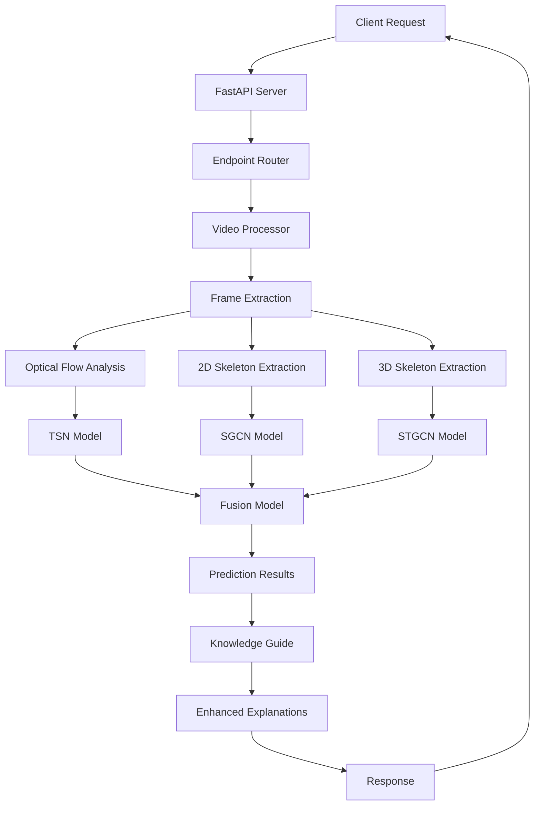

# Autism Screening API - Deployment Guide & System Architecture

## Overview

This document provides a comprehensive guide for deploying the Autism Screening API, a multimodal AI system for early autism screening using computer vision. The system analyzes video content to detect and classify autism-related behaviors, providing interpretable screening reports that link observed behaviors with literature-based diagnostic categories.

## System Architecture & Flow

### 📁 Project Structure
```
.
├── app/                    # Main application directory
│   ├── main.py                 # FastAPI entry point
│   ├── api/
│   │   ├── endpoints.py        # Basic screening endpoints
│   │   └── enhanced_endpoints.py  # Enhanced endpoints with explanations
│   ├── core/
│   │   ├── config.py           # Application settings
│   │   ├── models.py           # Pydantic models (CREATED)
│   │   └── enhanced_models.py  # Enhanced response models
│   ├── models/
│   │   ├── predictor.py        # Main prediction pipeline
│   │   ├── enhanced_predictor.py  # Enhanced predictor with knowledge guidance
│   │   ├── model_loader.py     # Loads trained models
│   │   ├── stgcn.py           # ST-GCN model architecture
│   │   └── graph_utils.py     # Graph utilities for skeleton processing
│   ├── services/
│   │   ├── video_processor.py  # Video preprocessing & feature extraction
│   │   ├── optical_flow.py     # Optical flow computation
│   │   ├── knowledge_guide.py  # Knowledge-guided explanations
│   │   ├── pdf_report.py       # PDF report generation
│   │   └── video_processor.py  # Video processing pipeline
│   └── static/
│       ├── index.html          # Web UI
│       ├── script.js           # Frontend JavaScript
│       └── styles.css          # Frontend CSS
├── model_weights/          # Directory containing trained model weights
│   ├── tsn_optical_flow.pth    # TSN model for optical flow analysis
│   ├── sgcn_2d.pth             # SGCN model for 2D skeleton analysis
│   ├── stgcn_3d.pth            # STGCN model for 3D skeleton analysis
│   └── fusion.pkl              # Fusion model for combining predictions
├── knowledge_corpus.csv    # Knowledge base linking models to diagnostic domains
├── Dockerfile              # Docker configuration for containerization
├── requirements.txt        # Python dependencies
├── .env                    # Environment configuration (optional)
├── .dockerignore           # Docker ignore patterns
└── DEPLOYMENT_WALKTHROUGH.md  # This document
```

## System Components Overview

The Autism Screening API consists of several key components working together to provide a comprehensive analysis:

| Component | Purpose | Key Files |
|-----------|---------|-----------|
| **API Layer** | Endpoints & request handling | [main.py](file:///c%3A/Autism/SW-AI-6-Knowledge-Guided-LVM-for-Early-Autism-Screening/app/main.py), [api/endpoints.py](file:///c%3A/Autism/SW-AI-6-Knowledge-Guided-LVM-for-Early-Autism-Screening/app/api/endpoints.py), [api/enhanced_endpoints.py](file:///c%3A/Autism/SW-AI-6-Knowledge-Guided-LVM-for-Early-Autism-Screening/app/api/enhanced_endpoints.py) |
| **Prediction Engine** | Model inference | [models/predictor.py](file:///c%3A/Autism/SW-AI-6-Knowledge-Guided-LVM-for-Early-Autism-Screening/app/models/predictor.py), [models/enhanced_predictor.py](file:///c%3A/Autism/SW-AI-6-Knowledge-Guided-LVM-for-Early-Autism-Screening/app/models/enhanced_predictor.py) |
| **Video Processing** | Feature extraction | [services/video_processor.py](file:///c%3A/Autism/SW-AI-6-Knowledge-Guided-LVM-for-Early-Autism-Screening/app/services/video_processor.py), [services/optical_flow.py](file:///c%3A/Autism/SW-AI-6-Knowledge-Guided-LVM-for-Early-Autism-Screening/app/services/optical_flow.py) |
| **Knowledge System** | Explanations | [services/knowledge_guide.py](file:///c%3A/Autism/SW-AI-6-Knowledge-Guided-LVM-for-Early-Autism-Screening/app/services/knowledge_guide.py) + [knowledge_corpus.csv](file:///c%3A/Autism/SW-AI-6-Knowledge-Guided-LVM-for-Early-Autism-Screening/knowledge_corpus.csv) |
| **Models** | Neural networks | [model_weights/*.pth](file:///c%3A/Autism/SW-AI-6-Knowledge-Guided-LVM-for-Early-Autism-Screening/model_weights/), [model_weights/*.pkl](file:///c%3A/Autism/SW-AI-6-Knowledge-Guided-LVM-for-Early-Autism-Screening/model_weights/) |
| **Configuration** | Settings | [core/config.py](file:///c%3A/Autism/SW-AI-6-Knowledge-Guided-LVM-for-Early-Autism-Screening/app/core/config.py) |

## Detailed System Flow

### 1. Application Startup Process

When the application starts, it follows this initialization sequence:

1. **Configuration Loading**: Settings are loaded from [app/core/config.py](file:///c%3A/Autism/SW-AI-6-Knowledge-Guided-LVM-for-Early-Autism-Screening/app/core/config.py) and environment variables
2. **Model Initialization**: All four AI models are loaded into memory:
   - TSN (Temporal Segment Network) for optical flow analysis
   - SGCN (Spatial GCN) for 2D skeleton analysis
   - STGCN (Spatial-Temporal GCN) for 3D skeleton analysis
   - Fusion model for combining individual predictions
3. **Service Initialization**: Video processing services are initialized
4. **API Readiness**: The FastAPI server becomes ready to accept requests

### 2. Request Handling Pipeline

The API provides two main endpoints for video analysis:

#### Basic Screening Endpoint
- **Endpoint**: `POST /api/v1/screen`
- **Purpose**: Analyze a video file for autism screening indicators
- **Process Flow**:
  1. Upload and validate video file
  2. Save to temporary storage
  3. Extract features using video processor
  4. Run predictions through all models
  5. Fuse results and interpret scores
  6. Return structured response
  7. Clean up temporary files

#### Enhanced Screening Endpoint
- **Endpoint**: `POST /api/v1/screen-with-explanation`
- **Purpose**: Same analysis as basic endpoint but with detailed explanations
- **Additional Features**:
  - Knowledge-guided interpretation of results
  - Mapping to clinical diagnostic domains
  - Clinical recommendations based on findings

### 3. Video Processing Pipeline

The video processing component extracts three types of features from uploaded videos:

1. **Frame Extraction**: 64 frames are uniformly sampled from the video
2. **Optical Flow Analysis** (TSN model):
   - Uses 10 frames for temporal analysis
   - Computes motion patterns between consecutive frames
3. **2D Skeleton Analysis** (SGCN model):
   - Extracts 2D pose using MediaPipe Pose from 4 frames
   - Processes 24 key body joints
4. **3D Skeleton Analysis** (STGCN model):
   - Extracts 3D pose using ROMP/MediaPipe from 32 frames
   - Analyzes spatial-temporal movement patterns

### 4. Prediction and Fusion Process

The prediction pipeline combines results from multiple models:

1. **Individual Model Predictions**:
   - TSN analyzes optical flow for repetitive behaviors
   - SGCN examines 2D skeletal movements for social interaction patterns
   - STGCN evaluates 3D movement dynamics for motor development indicators
2. **Result Fusion**:
   - A GradientBoostingRegressor combines individual scores
   - Produces a final ADOS-like comparison score (1-10 scale)
3. **Score Interpretation**:
   - 1-3: Minimal evidence of autism symptoms
   - 4-5: Mild symptoms present
   - 6-7: Moderate symptoms
   - 8-10: Significant symptoms

### 5. Knowledge-Guided Enhancement

For enhanced endpoints, the system provides additional interpretability:

1. **Dominant Model Identification**: Determines which models most influenced the prediction
2. **Domain Mapping**: Links model outputs to clinical diagnostic domains
3. **Clinical Recommendations**: Provides actionable guidance based on findings
4. **PDF Report Generation**: Creates downloadable detailed reports

## Configuration and Environment

### Key Configuration Settings

The application can be configured through [app/core/config.py](file:///c%3A/Autism/SW-AI-6-Knowledge-Guided-LVM-for-Early-Autism-Screening/app/core/config.py) and environment variables:

- **DEVICE**: `cuda` (GPU) or `cpu` for model inference
- **FRAME_SIZE**: Video frame dimensions (default: 224x224)
- **MAX_VIDEO_SIZE**: Maximum allowed video file size (default: 100MB)
- **ALLOWED_EXTENSIONS**: Supported video formats (.mp4, .avi, .mov, .mkv)

### Environment Variables

Create a `.env` file in the project root for configuration:

```env
DEVICE=cuda
API_TITLE=Autism Screening API
API_VERSION=1.0.0
HOST=0.0.0.0
PORT=8000
```

## Deployment Prerequisites

### Required Files

Before deployment, ensure these files are present:

1. **Model Weights** (in [model_weights/](file:///c%3A/Autism/SW-AI-6-Knowledge-Guided-LVM-for-Early-Autism-Screening/model_weights/) directory):
   - [tsn_optical_flow.pth](file:///c%3A/Autism/SW-AI-6-Knowledge-Guided-LVM-for-Early-Autism-Screening/model_weights/tsn_optical_flow.pth) - TSN model weights
   - [sgcn_2d.pth](file:///c%3A/Autism/SW-AI-6-Knowledge-Guided-LVM-for-Early-Autism-Screening/model_weights/sgcn_2d.pth) - SGCN model weights
   - [stgcn_3d.pth](file:///c%3A/Autism/SW-AI-6-Knowledge-Guided-LVM-for-Early-Autism-Screening/model_weights/stgcn_3d.pth) - STGCN model weights
   - [fusion.pkl](file:///c%3A/Autism/SW-AI-6-Knowledge-Guided-LVM-for-Early-Autism-Screening/model_weights/fusion.pkl) - Fusion model weights

2. **Knowledge Corpus**:
   - [knowledge_corpus.csv](file:///c%3A/Autism/SW-AI-6-Knowledge-Guided-LVM-for-Early-Autism-Screening/knowledge_corpus.csv) - Diagnostic domain mappings

3. **Dependencies**:
   - All packages listed in [requirements.txt](file:///c%3A/Autism/SW-AI-6-Knowledge-Guided-LVM-for-Early-Autism-Screening/requirements.txt)

## Deployment Options

### Local Deployment with Docker

1. **Build Docker Image**:
   ```bash
   docker build -t autism-screening-api .
   ```

2. **Run Container**:
   ```bash
   docker run -p 8000:8000 autism-screening-api
   ```

3. **Access API**:
   - API endpoints: `http://localhost:8000/api/v1/`
   - Documentation: `http://localhost:8000/docs`
   - Health check: `http://localhost:8000/health`

### Cloud Deployment (Crane Cloud)

1. **Prepare Repository**:
   - Push code to your Git repository
   - Ensure all model files are included or separately uploaded

2. **Create Deployment**:
   - Configure with Dockerfile
   - Upload model files to [model_weights/](file:///c%3A/Autism/SW-AI-6-Knowledge-Guided-LVM-for-Early-Autism-Screening/model_weights/) directory
   - Set environment variables as needed

3. **Configuration**:
   - For GPU instances: Keep `DEVICE=cuda`
   - For CPU-only instances: Set `DEVICE=cpu`
   - Adjust memory allocation based on model sizes

## API Endpoints

### Health and Information Endpoints

1. **Health Check**:
   ```bash
   curl http://localhost:8000/health
   ```

2. **Root Information**:
   ```bash
   curl http://localhost:8000/
   ```

3. **Model Information**:
   ```bash
   curl http://localhost:8000/api/v1/model-info
   ```

### Screening Endpoints

1. **Basic Screening**:
   ```bash
   curl -X POST "http://localhost:8000/api/v1/screen" \
     -F "file=@/path/to/video.mp4"
   ```

2. **Enhanced Screening with Explanations**:
   ```bash
   curl -X POST "http://localhost:8000/api/v1/screen-with-explanation" \
     -F "file=@/path/to/video.mp4"
   ```

3. **Batch Screening**:
   ```bash
   curl -X POST "http://localhost:8000/api/v1/batch-screen" \
     -F "files=@/path/to/video1.mp4" \
     -F "files=@/path/to/video2.mp4"
   ```

4. **Score Interpretation** (without video):
   ```bash
   curl "http://localhost:8000/api/v1/interpret-score?score=6.5"
   ```

### Documentation

- **Swagger UI**: `http://localhost:8000/docs`
- **ReDoc**: `http://localhost:8000/redoc`

## Troubleshooting Common Issues

### Model Loading Failures

**Problem**: `Model {name} is not loaded`
**Solution**: 
- Verify all model files exist in [model_weights/](file:///c%3A/Autism/SW-AI-6-Knowledge-Guided-LVM-for-Early-Autism-Screening/model_weights/) directory
- Check file permissions
- Ensure sufficient disk space

### GPU Memory Issues

**Problem**: `CUDA out of memory`
**Solutions**:
- Change `DEVICE` to `"cpu"` in [config.py](file:///c%3A/Autism/SW-AI-6-Knowledge-Guided-LVM-for-Early-Autism-Screening/app/core/config.py)
- Reduce batch size in configuration
- Use a machine with more GPU memory

### Video Processing Errors

**Problem**: `Cannot open video file` or codec issues
**Solutions**:
- Ensure video format is supported (.mp4, .avi, .mov, .mkv)
- Verify ffmpeg is installed in the environment
- Check that the video file is not corrupted

### MediaPipe Initialization Failures

**Problem**: `Error initializing pose estimators`
**Solution**: 
- The system gracefully handles these errors by falling back to zero values
- Ensure system dependencies are installed (libsm6, libxext6, libxrender-dev, libgl1-mesa-glx)

## Performance Considerations

### Resource Requirements

- **CPU**: Multi-core processor recommended
- **RAM**: Minimum 8GB, 16GB+ recommended
- **Storage**: 5GB+ for model files and temporary processing
- **GPU**: CUDA-compatible GPU with 8GB+ VRAM for optimal performance

### Processing Times

Typical processing times for a 30-second video:
- **GPU (CUDA)**: 15-30 seconds
- **CPU**: 60-120 seconds

Factors affecting performance:
- Video resolution and length
- System hardware specifications
- Concurrent request load

## Security Considerations

### Data Privacy

- Videos are processed in-memory and deleted immediately after analysis
- No video data is stored permanently
- All processing occurs locally within the deployed environment

### API Security

- Consider implementing API key authentication for production use
- Configure CORS settings appropriately
- Use HTTPS in production environments

## Maintenance and Updates

### Model Updates

To update models:
1. Replace corresponding files in [model_weights/](file:///c%3A/Autism/SW-AI-6-Knowledge-Guided-LVM-for-Early-Autism-Screening/model_weights/) directory
2. Restart the application to load new models

### Knowledge Base Updates

To update clinical knowledge mappings:
1. Modify [knowledge_corpus.csv](file:///c%3A/Autism/SW-AI-6-Knowledge-Guided-LVM-for-Early-Autism-Screening/knowledge_corpus.csv)
2. Restart the application to reload the knowledge base

### System Updates

To update the application:
1. Pull latest code changes
2. Update dependencies if [requirements.txt](file:///c%3A/Autism/SW-AI-6-Knowledge-Guided-LVM-for-Early-Autism-Screening/requirements.txt) has changed
3. Restart the application

## Architecture Diagram

